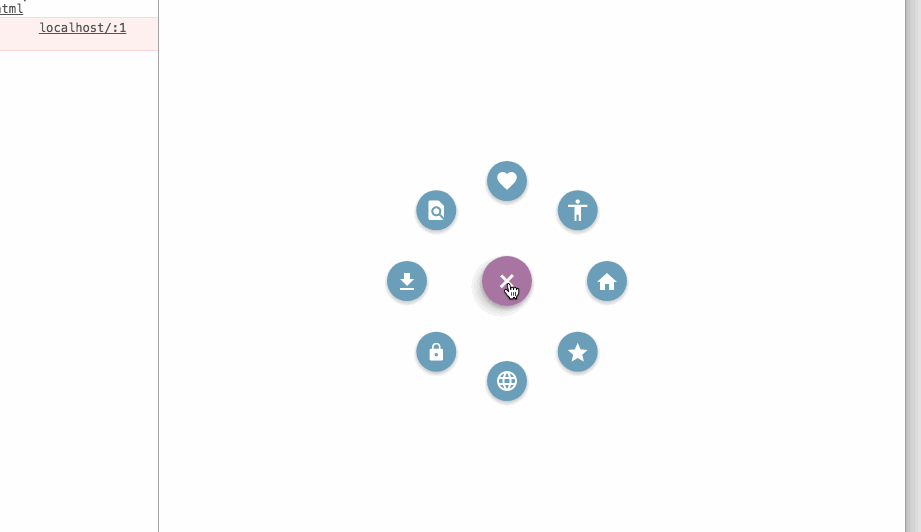

# vue-bloom-menu
> ##### inspired by blooming-menu

#### 这是一个使用vue加css动画制作的menu，基于其他插件改写成vue的实现方式，可以用作菜单导航栏，后期加上vue-router,稍后把详细教程写在博客里
-----
#### [在线演示地址](https://mingseng-w.github.io/vue-bloom-menu/)
----

### 实例效果演示

 1. 点击menu的button之后的效果

 2. 点击item之后的效果

 3. 加上vue-router之后的效果(pending)

### get started
* 	git clone https://github.com/MingSeng-W/vue-bloom-menu.git
*  npm install
*  npm run dev
*  之后访问浏览器的8080端口，可以看到项目跑起来了(now please checkout the port 8080 in your browser, you will see the menu in page)

### usage
	to be countinue
### simple tutorial
	to be countinue
#### about author
欢迎拍砖，email:wanghongjieUESTC@outlook.com,如果你觉得对你有帮助，请给我个star以示鼓励

