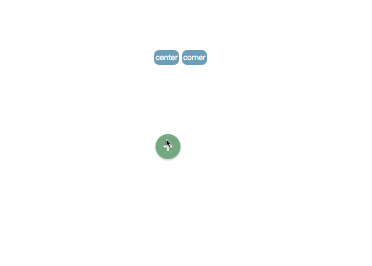
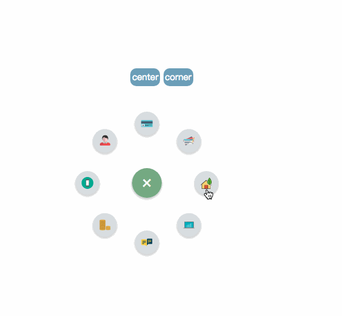
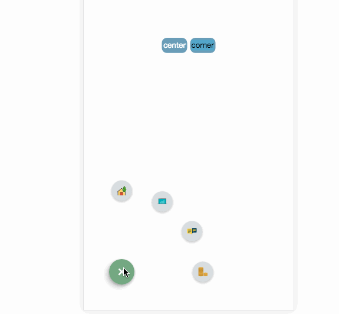

# vue-bloom-menu
> ##### inspired by blooming-menu
##### 这是一个使用vue加css动画制作的menu，基于其他插件改写成vue的实现方式，可以用作菜单导航栏，后期加上vue-router,稍后把详细教程写在博客里


## 技术栈:vue+vue-router+webpack

#### [在线演示地址](https://mingseng-w.github.io/vue-bloom-menu/)
----

### 实例效果演示

 1. 点击menu的button之后的效果


 2. 点击item之后的效果



 3.left corner
 
 

 4.加上vue-router之后的menu(pending)

### get started
----
* 	git clone https://github.com/MingSeng-W/vue-bloom-menu.git
*  npm install
*  npm run dev
*  之后访问浏览器的8080端口，可以看到项目跑起来了(now please check the port 8080 in your browser, you will see the menu in the page)

### usage
 -----
##### 模板部分     	 
```html
<template>
  <div>
    <Bloom-menu
      :iconImgArr="iconImgArr"
      :radius="radius"
      :startAngle="startAngle"
      :endAngle="endAngle"
      :itemNum="itemNum"
      :animationDuration="animationDuration"
      :itemAnimationDelay="itemAnimationDelay"
      class="menu-center-wrapper"
    >
    </Bloom-menu>
  </div>

</template>			
```
##### css部分	
```css
@import 'common/stylus/menuConfig.styl'
```
	1. 	配置参数
		*  radius：default为100px
		*  startAngle:defaut为0
		*  endAngle:default为315
		*  itemNum:default为8
		*  animationDuration:default为0.5s
		*  itemAnimationDelay:default为0.04s
		*  iconImgArr: 必选参数，该属性使用computed属性生成,是装icon的数组,方便使用自己的icon,元素为object，使用函数genarateIconObj生成
	
```javascript
example:
	  import home from 'common/img/home.svg'
	  ....
	  computed: {
      iconImgArr () {
        let tmp = []
        tmp.push(this.genarateIconObj(home, 'home', '50'))
        return tmp
      }
    },      	
		 // 分别指定图标的url ,类名称， 以及background-size属性
      	 genarateIconObj (url, name, size)
```
 		
### key step 
----
关键步骤写在博客里面了
	[简书]()
### about author
---
　　有问题邮件联系我，email:wanghongjieUESTC@outlook.com,如果您觉得对您有帮助，请给我个star🙂


